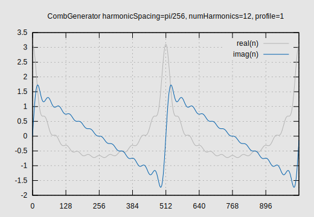
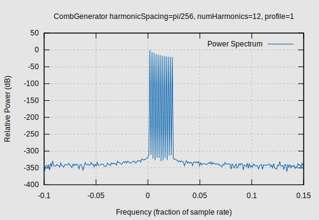

# ReiserRT_CombGenerator

Frank Reiser's C++17 implementation of a fast and accurate harmonic series, waveform generator.
The data produced is complex in nature, delivering both in-phase and quadrature components.
This library component is dependent on the ReiserRT_FlyingPhasor shared object library.

It is possible to use this library from C++11 compiles. However, 
this is dependent on the actual compiler used. The test harness will not compile with
gcc 4.8.5 using the c++11 standard but will compile with gcc 8.5.0.
This is because the shared "block" pointer syntax, used by the interface, is not adequately defined
in the c++11 standard. This was rectified in c++17. It is recommended that you use this library
with c++17 or higher compilation. The compiled library code is built using the c++17 standard.

## Overview

This generator evolved out of a desire to generate a harmonic series of tones
of various magnitudes, starting phases, and as fast and accurate as practical.
It supports any number of harmonic tones spaced at some fundamental frequency.
Additionally, it provides hooks to perform envelope modulation on a tone by tone basis.

The implementation uses a collection of ReiserRT_FlyingPhasor instances, specified for some maximum
use case at time of construction. Refer to project ReiserRT_FlyingPhasor for specifics.

## Details

A CombGenerator is instantiated for some maximum number of harmonics that will ever
be requested for an application. Once instantiated, it requires a `reset` operation.
It is at `reset` time, where initial phases and magnitudes are set. Additionally, an
envelope modulator may be hooked up at `reset` time.

As discussed at the top of this README, CombGenerator requires a shared "block" pointer interface
for specifying magnitude and starting phase for the harmonic tones. A `nullptr` may be used for
default values. This shared "block" pointer interface was a design decision. It is anticipated that
CombGenerator instances are seldom `reset` and that it would be the `getSamples`
operation that is primarily leveraged. It is the `getSamples` operation
that actually makes use of any magnitude vector we register with `reset`.
By specifying a shared pointer type, we are ensuring a reference count on it.
Anticipated use cases of CombGenerator call for a sharing of magnitude vectors.
Other design choices were considered such as copying the const data at registration time but,
this seemed wasteful. Also considered was just storing the data address and trusting the client
to maintain the storage but, this seemed unsafe. Reference counting seemed the best choice.
The below snippet shows one way how this shared "block" pointer may be accomplished.
You could also use the BlockPool provided by ReiserRT_Core.

   ```
   // Allocate block of doubles and encapsulate in a unique pointer.
   const size_t numHarmonics = 12;
   std::unique_ptr< double[] > magnitudes{ new double[ numHarmonics ] };
   
   // Set magnitues values however required
   ...
   
   // Move unique pointer into shared pointer which may be referenced numerous times.
   // This CombGeneratorScalarVectorType also makes the data constant.
   // Mutliple references are read only.
   //
   // NOTE: the 'array' syntax for shared pointers is required and is only reliably 
   // supported by the C++17 standard.
   CombGeneratorScalarVectorType sharedMagnitudes{ std::move( magnitudes ) };
   
   // Reset a CombGenerator instance. It will increment the reference count on this data
   // and maintain it until reset with new data, or destroyed.
   // In this particular example, we are accepting defaults for starting phases
   // and an empty envelope functor.
   const double fundamentalRadiansPerSample = 0.1;
   combGenerator.reset( numHarmonics, fundamentalRadiansPerSample, sharedMagnitudes, nullptr );
   ```

Samples are obtained by invoking the `getSamples` operation. If an envelope modulator
is hooked up, it will be notified once per `numHarmonics`. This notification comes with
numerous 'hints' that the observer may utilize in returning an envelope. These are,
the current sample offset (a count), the number of samples of envelope to return,
the current harmonic (0=fundamental), and the nominal magnitude for the harmonic.
Additional state data may be managed by the observer instance.

Please refer to the test harness and sundry applications for additional details.

# Example Data Characteristics
Here, we present some example data created with the 'streamCombGenerator' utility program included
with the project. We generated 1024 samples with 12 harmonics (fundamental inclusive), 
with a harmonic spacing of pi/256 radians per sample, using profile 1 (sawtooth waveform profile).
This data is plotted below:

Figure 1 - Example Comb Generator Sample Series Data



This data is complex in nature, having both real and imaginary components. The imaginary component
shows the typical "sawtooth" pattern that would result from adding sinusoids for N harmonics where
the amplitudes are scaled by the reciprocal of their harmonic number and all start at a phase of 0 radians.
This data looks pretty good. What does the spectrum look like? Are there any notable spurs in the frequency domain?
We will take a look at the power spectrum, plotted in decibels for an extended dynamic range view. We
did not apply any window to the sample series data here as our harmonic tones are right on a basis functions.
Applying a window in this case would distract from our analysis.
This data is plotted below:

Figure 2 - Example Comb Generator Power Spectrum



As can be seen, we have in excess of 300 dB of spur free dynamic range in the portion of the spectrum plotted.
It does however extend to the portions, left and right, not plotted. The plot has the look of a comb. The harmonic
tones are evenly spaced. This power spectrum plot is why this generator gets the name of "Comb Generator".

# Interface Compatibility
This component has been tested to be interface-able with C++20 compiles. Note that the compiled library code
is built using the c++17 standard. API/ABI stability will be maintained between minor versions of this project.

# Dependencies
This component is dependent upon ReiserRT_FlyingPhasor, version 3.0 in order to configure and build.

## Thread Safety
This Comb Generator is NOT "thread safe". There are no concurrent access mechanisms
in place and there is no good reason for addressing this. To the contrary,
state left by one thread would make no sense to another, never mind the concurrency issues.
Have threads use their own unique instances.

## Building and Installation
Roughly as follows:
1) Obtain a copy of the project
2) Create a build folder within the project root folder.
3) Switch directory to the build folder and run the following
   to configure and build the project for your platform:
   ```
   cmake ..
   cmake --build .
   ```
4) Test the library
   ```
   ctest
   ```
5) Install the library as follows (You'll most likely
   need root permissions to do this):
   ```
   sudo cmake --install .
   ```
